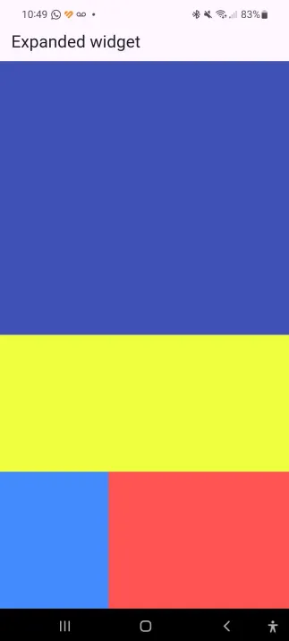
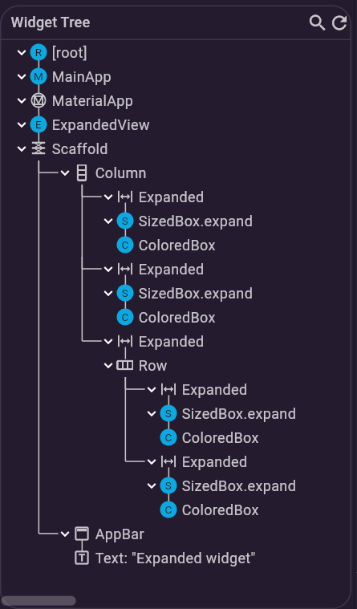
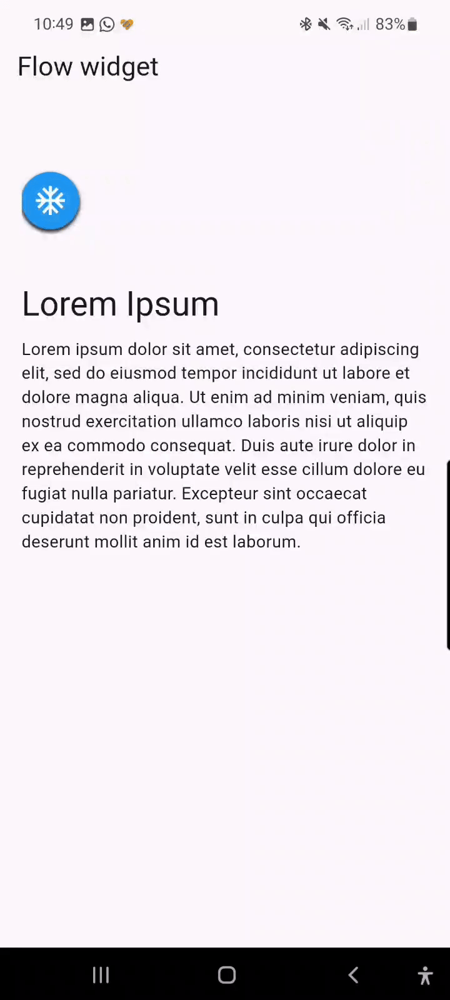
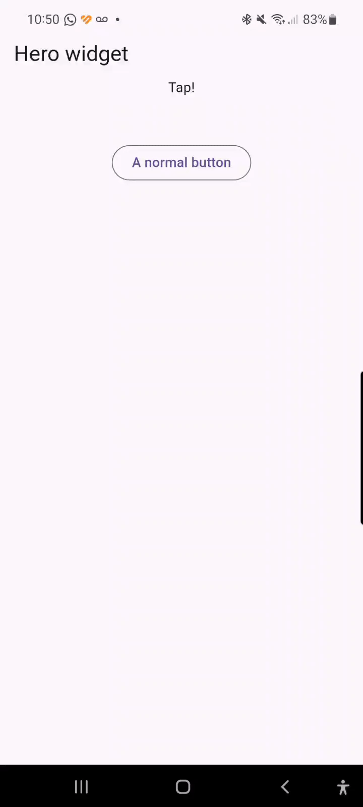
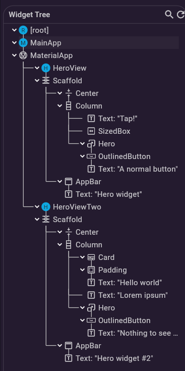
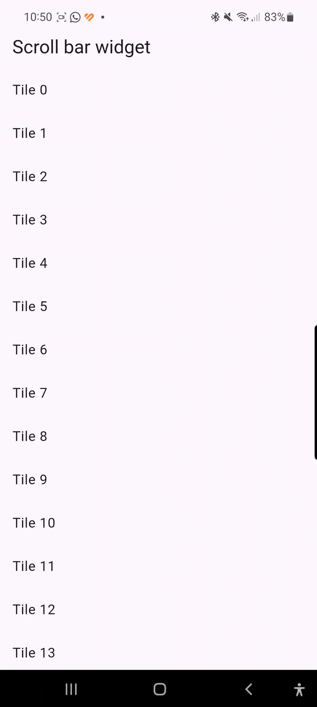
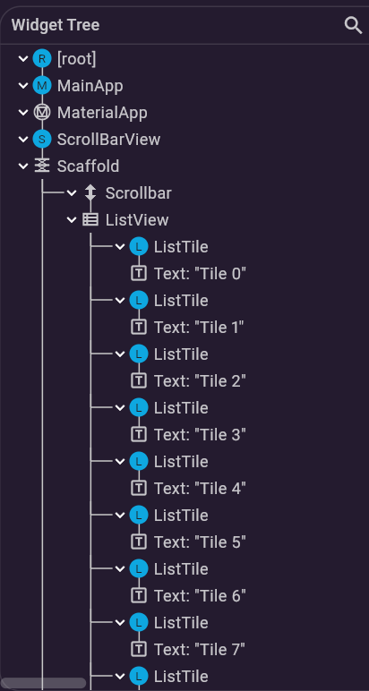
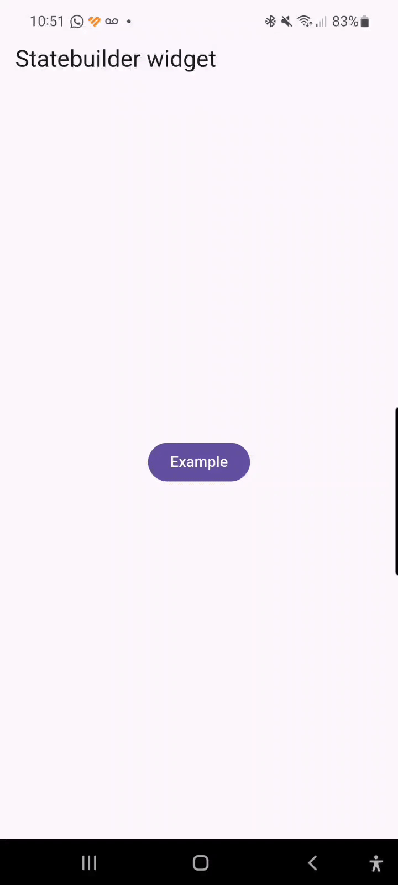
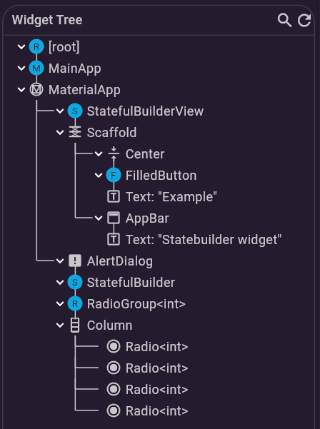

# 🎮 Playground — Elementos de Interfaz en Flutter

> **Curso:** Desarrollo de Aplicaciones Móviles  
> **Herramienta:** Flutter 3.38.7 · Dart 3.10  
> **Propósito:** Visualizar, interactuar y documentar los elementos de interfaz proporcionados por Flutter, probar la respuesta a eventos del usuario y registrar las salidas de cada componente.

---

## 📋 Tabla de contenidos

- [🎮 Playground — Elementos de Interfaz en Flutter](#-playground--elementos-de-interfaz-en-flutter)
  - [📋 Tabla de contenidos](#-tabla-de-contenidos)
  - [Estructura del proyecto](#estructura-del-proyecto)
  - [Configuración y ejecución](#configuración-y-ejecución)
    - [Prerrequisitos](#prerrequisitos)
    - [Pasos](#pasos)
  - [Widgets documentados](#widgets-documentados)
    - [1. Expanded](#1-expanded)
      - [Captura de pantalla](#captura-de-pantalla)
      - [Árbol de widgets](#árbol-de-widgets)
    - [2. Flow](#2-flow)
      - [Demo interactiva](#demo-interactiva)
      - [Árbol de widgets](#árbol-de-widgets-1)
    - [3. Hero](#3-hero)
      - [Demo interactiva](#demo-interactiva-1)
      - [Árbol de widgets](#árbol-de-widgets-2)
    - [4. Scrollbar](#4-scrollbar)
      - [Demo interactiva](#demo-interactiva-2)
      - [Árbol de widgets](#árbol-de-widgets-3)
    - [5. StatefulBuilder](#5-statefulbuilder)
      - [Demo interactiva](#demo-interactiva-3)
      - [Árbol de widgets](#árbol-de-widgets-4)
  - [Árbol de widgets](#árbol-de-widgets-5)
  - [Demos interactivas](#demos-interactivas)
  - [Eventos y respuestas observadas](#eventos-y-respuestas-observadas)
  - [Conclusiones](#conclusiones)

---

## Estructura del proyecto

```
playground_1/
├── lib/
│   ├── main.dart                          # Punto de entrada, rutas
│   ├── helpers/
│   │   └── route_names.dart               # Constantes de rutas
│   └── t1_widgets/
│       ├── t1_widgets.dart                # Barrel export
│       ├── expanded_view.dart             # Demo: Expanded
│       ├── flow_view.dart                 # Demo: Flow + FlowDelegate
│       ├── hero_view.dart                 # Demo: Hero (pantalla 1)
│       ├── hero_view_two.dart             # Demo: Hero (pantalla 2)
│       ├── scroll_bar_view.dart           # Demo: Scrollbar
│       └── stateful_builder_view.dart     # Demo: StatefulBuilder
└── repository_assets/
    ├── gifs/                              # Grabaciones de interacción
    │   ├── flow_view.gif
    │   ├── hero_view.gif
    │   ├── scroll_bar_view.gif
    │   └── stateful_builder_view.gif
    └── imgs/
        ├── views/                         # Capturas de pantalla de las vistas
        │   └── expanded_view.webp
        └── widget_tree/                   # Árboles de widgets generados
            ├── widget_stateful_builder_example.png
            ├── widget_tree_expanded_example.png
            ├── widget_tree_flow_example.png
            ├── widget_tree_hero_example.png
            └── widget_tree_scroll_bar_example.png
```

---

## Configuración y ejecución

### Prerrequisitos

- [Flutter SDK](https://flutter.dev/get-started/) (se recomienda usar [FVM](https://fvm.app/) para mantener la versión)
- Dart `>=3.10.0`

### Pasos

```bash
# 1. Clonar el repositorio
git clone <url-del-repo>
cd playground_1

# 2. Instalar la versión de Flutter indicada (si usas FVM)
fvm install
fvm use

# 3. Obtener dependencias
flutter pub get

# 4. Ejecutar la aplicación
flutter run
```

> **Cambiar la vista inicial:** En `lib/main.dart`, modifica el valor de `initialRoute` y haz un *hot restart* (`R` en la consola) para ver cada demo de forma independiente.

```dart
initialRoute: RouteNames.statefulBuilder, // <- cambiar aquí
```

---

## Widgets documentados

Cada sección describe el widget, su propósito, los parámetros principales que se utilizan en la demo y los eventos que responde.

---

### 1. Expanded

> **Archivo:** `lib/t1_widgets/expanded_view.dart`

El widget **Expanded** se utiliza para dividir el espacio disponible dentro de un `Column` o `Row` en proporciones definidas por su parámetro `flex`. El valor por defecto de `flex` es `1`, lo que significa que ocupa todo el espacio libre; al asignar valores distintos entre varios `Expanded` hermanos se logra un reparto proporcional automático.

**Parámetros clave utilizados:**

| Parámetro | Valor en demo | Efecto |
|-----------|---------------|--------|
| `flex`    | `2`           | Ocupa el doble de espacio que un `flex: 1` |
| `flex`    | `1`           | Referencia base de proporción |
| `flex`    | `3` / `5`     | Reparto horizontal desigual dentro de un `Row` |

**Eventos observados:** Este widget no responde a interacciones directas del usuario; su comportamiento es puramente de diseño de layout y se recalcula automáticamente al cambiar el tamaño de la pantalla (rotación del dispositivo).

#### Captura de pantalla



#### Árbol de widgets



---

### 2. Flow

> **Archivo:** `lib/t1_widgets/flow_view.dart`

El widget **Flow** es un widget complejo que permite posicionar sus hijos de forma dinámica mediante un `FlowDelegate` personalizado. En esta demo se implementa un menú de iconos tipo FAB (Floating Action Button expandible) que utiliza un `AnimationController` para controlar la transición entre el estado cerrado y abierto.

**Parámetros clave utilizados:**

| Elemento | Rol |
|----------|-----|
| `AnimationController` | Controla la duración y progreso de la animación de apertura/cierre |
| `FlowDelegate` | Define cómo se pintan y posicionan los hijos mediante `paintChildren` y transformaciones matriciales |
| `RawMaterialButton` | Cada ítem del menú; al presionarlo se activa o invierte la animación |

**Eventos observados:**

- **Tap sobre el ítem central (menú):** Abre o cierra el menú mediante `menuAnimation.forward()` / `menuAnimation.reverse()`.
- **Tap sobre cualquier otro ítem:** Actualiza el ícono seleccionado (`lastTapped`) y cierra el menú.
- El color del botón activo cambia visualmente para indicar la selección actual.

#### Demo interactiva



#### Árbol de widgets


---

### 3. Hero

> **Archivos:** `lib/t1_widgets/hero_view.dart` · `lib/t1_widgets/hero_view_two.dart`

El widget **Hero** permite crear animaciones de transición suaves entre dos rutas cuando ambas contienen un widget `Hero` con el mismo `tag`. Flutter interpola automáticamente la posición, tamaño y otras propiedades del widget entre una pantalla y la siguiente, generando un efecto de "vuelo" visual sin código de animación manual.

**Parámetros clave utilizados:**

| Parámetro | Valor | Efecto |
|-----------|-------|--------|
| `tag`     | `"herotag"` | Identificador que conecta los dos `Hero` entre rutas |
| `child`   | `OutlinedButton` | El widget que se anima en la transición |

**Eventos observados:**

- **Tap sobre el botón en pantalla 1:** Se ejecuta `Navigator.push()` y el botón "vuela" animadamente hacia su nueva posición en la pantalla 2.
- **Gesto de retroceso (back):** El mismo widget hace la animación inversa de vuelta a la pantalla original.

#### Demo interactiva



#### Árbol de widgets



---

### 4. Scrollbar

> **Archivo:** `lib/t1_widgets/scroll_bar_view.dart`

El widget **Scrollbar** proporciona retroalimentación visual al usuario cuando el contenido excede el tamaño de la pantalla. Es especialmente útil en pantallas con grandes cantidades de texto, como acuerdos de términos o listas largas. En esta demo se conecta un `ScrollController` para tener control programático sobre la posición de scroll.

**Parámetros clave utilizados:**

| Elemento | Rol |
|----------|-----|
| `ScrollController` | Permite monitorear y controlar la posición del scroll; se dispone en `dispose()` para evitar memory leaks |
| `Scrollbar` | Widget que dibuja la barra lateral |
| `ListView.builder` | Genera 100 tiles de forma eficiente sin construir todos simultáneamente |

**Eventos observados:**

- **Gesto de scroll (swipe vertical):** La barra lateral aparece y se desplaza proporcionalmente al contenido.
- **Tap sobre un ListTile:** No ejecuta acción en esta demo, pero el evento de tap es capturado por el framework.
- El `ScrollController` registra los cambios de posición en tiempo real.

#### Demo interactiva



#### Árbol de widgets



---

### 5. StatefulBuilder

> **Archivo:** `lib/t1_widgets/stateful_builder_view.dart`

El widget **StatefulBuilder** proporciona una región de estado local sin necesidad de crear una clase `StatefulWidget` separada. Recibe un callback `builder` que expone un nuevo `BuildContext` y una función `StateSetter` (equivalente a `setState`), permitiendo reconstruir únicamente la parte del árbol que lo contiene.

En esta demo se implementa dentro de un `showDialog`: al presionar el botón se abre un `AlertDialog` que contiene un grupo de `Radio` cuya selección se maneja íntegramente con el `StatefulBuilder`.

**Parámetros clave utilizados:**

| Elemento | Rol |
|----------|-----|
| `StatefulBuilder` | Aporta capacidad de estado local dentro del diálogo |
| `StateSetter setState` | Callback que reconstruye el subtárbol cuando cambia `selectedRadio` |
| `RadioGroup` / `Radio` | Componentes que muestran y modifican la selección |

**Eventos observados:**

- **Tap sobre el botón "Example":** Se abre el diálogo con los 4 radio buttons.
- **Tap sobre un Radio:** Se actualiza `selectedRadio` mediante `setState` y la selección visual cambia inmediatamente sin cerrar el diálogo.
- **Tap fuera del diálogo o en el botón de cierre:** El diálogo se descarta y el estado local se pierde (comportamiento esperado de un estado efímero).

#### Demo interactiva



#### Árbol de widgets



---

## Árbol de widgets

Los árboles de widgets fueron generados durante la ejecución de la aplicación para visualizar la composición interna de cada vista. Cada imagen muestra la jerarquía de widgets desde la raíz (`Scaffold`) hasta los componentes hoja.

| Widget | Árbol |
|--------|-------|
| Expanded |  |
| Flow |  |
| Hero |  |
| Scrollbar |  |
| StatefulBuilder |  |

---

## Demos interactivas

Las siguientes grabaciones muestran la respuesta en tiempo real de cada widget a los gestos y eventos del usuario.

| Widget | GIF |
|--------|-----|
| Flow |  |
| Hero |  |
| Scrollbar |  |
| StatefulBuilder |  |

---

## Eventos y respuestas observadas

La siguiente tabla resume los eventos probados en cada widget y la respuesta que produjo la aplicación:

| Widget | Evento | Respuesta observada |
|--------|--------|---------------------|
| **Expanded** | Rotación de dispositivo | El layout se recalcula proporcionalmente según los valores de `flex` |
| **Flow** | Tap en botón central | El menú se expande/colapsa con animación (`AnimationController`) |
| **Flow** | Tap en ítem secundario | Se actualiza el ícono activo y el menú se cierra |
| **Hero** | Tap en botón (pantalla 1) | El botón "vuela" animadamente a la pantalla 2 |
| **Hero** | Gesto de retroceso | La animación del Hero se invierte al volver a la pantalla 1 |
| **Scrollbar** | Swipe vertical | La barra lateral se desplaza proporcionalmente al contenido |
| **Scrollbar** | Scroll al final de la lista | La barra llega a la posición inferior y se detiene |
| **StatefulBuilder** | Tap en "Example" | Se abre el `AlertDialog` con los radio buttons |
| **StatefulBuilder** | Tap en un Radio | La selección cambia visualmente en tiempo real sin cerrar el diálogo |
| **StatefulBuilder** | Tap fuera del diálogo | El diálogo se descarta y el estado local se elimina |

---

## Conclusiones

- El widget **Expanded** es fundamental para crear layouts flexibles y responsivos; su comportamiento es puramente declarativo y no requiere gestión de estado.
- **Flow** permite composiciones de layout avanzadas cuando los widgets hijos necesitan movimiento animado coordinado; la clave es implementar correctamente el `FlowDelegate`.
- **Hero** simplifica enormemente las animaciones de transición entre rutas; solo se requiere compartir el mismo `tag` entre las dos pantallas.
- **Scrollbar** mejora la experiencia de usuario en contenido largo y se integra fácilmente mediante un `ScrollController`.
- **StatefulBuilder** es la solución más limpia cuando se necesita estado local en un contexto pequeño (como un diálogo), evitando la creación de clases `StatefulWidget` adicionales.

---

*Documentación generada como parte de la tarea: Elementos de la interfaz — Diseñe, desarrolle, ejecute y documente una aplicación móvil que permita visualizar e interactuar con los diversos elementos de interfaz manejados por la herramienta de desarrollo.*